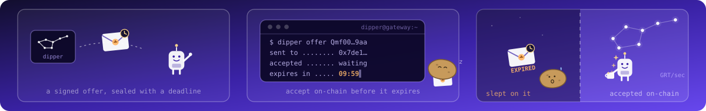
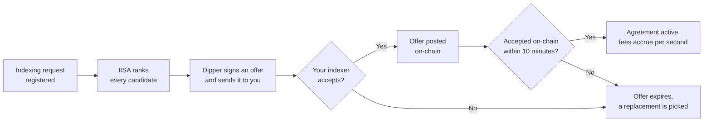

# Dipper

**The gateway for Direct Indexing Payments on The Graph**

 

[At a glance](#at-a-glance) | [How an agreement reaches you](#how-an-agreement-reaches-you) | [Inside an offer](#what-is-in-an-offer) | [Receiving offers](#how-to-receive-offers) | [Staying selected](#staying-selected) | [Operating dipper](#operating-dipper) | [Repository layout](#repository-layout)

---

Dipper is the gateway service for Direct Indexing Payments (DIPs) on The Graph. Under DIPs, an indexer is paid a recurring per-second fee to index and serve a specific subgraph deployment. Dipper is the service that decides which indexers are offered those agreements, signs and delivers the offers, records acceptance on-chain, and replaces indexers that fall behind.

If you run an indexer, this repository is where you find out how offers reach you, what is inside one, how long you have to accept, and what can exclude you from selection.

---

## At a glance

| Question | Answer |
|---|---|
| **What dipper offers you** | A signed recurring payment agreement to index and serve 1 subgraph deployment |
| **How indexers are chosen** | The [IISA service](https://github.com/edgeandnode/subgraph-dips-indexer-selection) re-ranks every candidate daily on price, performance, and stake |
| **How long you have to accept** | 10 minutes from the moment the offer is signed, by accepting on-chain |
| **How you are paid** | Fees accrue every second and you collect them on-chain; dipper never holds your money |
| **What gets you skipped** | An unusable query URL, pricing far above the chain minimum, ignoring offers, or the denylist |

---

## How an agreement reaches you

A requester registers an indexing request with dipper naming a subgraph deployment and how many indexers it needs. Dipper asks the [IISA service](https://github.com/edgeandnode/subgraph-dips-indexer-selection) for the best candidates, compares that recommendation against the agreements that already exist, and prepares an offer for each new pick.

The offer is a recurring collection agreement signed by dipper. It is first delivered to your indexer software, which can accept or decline it off-chain. If it accepts, dipper posts the offer on-chain so the contract can verify it, and from there the deadline applies: the agreement must be accepted on-chain before it expires, 10 minutes after signing by default.

Miss the deadline and the offer expires; dipper queues a fresh selection to find a replacement. The expiry check runs against chain time with a 300-second grace period, and because dipper learns about acceptances by polling the indexing-payments subgraph, an acceptance it only notices late still counts: an agreement marked expired is revived when the acceptance shows up.

---

## What is in an offer

Every offer is priced from what you publish. IISA reports your current DIPs price for the deployment's chain, and dipper falls back to its static pricing table when IISA has none; an indexer with no known price at all is never offered an agreement.

| Field | What it means | Default |
|---|---|---|
| `deadline` | The last moment the agreement can be accepted on-chain | 10 minutes after signing |
| `endsAt` | When the agreement ends on its own | Open-ended; agreements end by cancellation |
| `tokensPerSecond`, `tokensPerEntityPerSecond` | Your price for this deployment | From your published DIPs pricing |
| `minSecondsPerCollection`, `maxSecondsPerCollection` | How often fees can be collected | Between 1 and 28 days apart |
| `maxOngoingTokensPerSecond` | A hard ceiling on what any 1 agreement can pay | 20,000 GRT per 30 days |

Once accepted, fees accrue continuously: elapsed seconds multiplied by your tokens per second, plus a per-entity component scaled by the entities you serve. Collection happens on-chain through the RecurringCollector contract at your initiative; dipper is not part of the payment path and holds no funds. Agreements have no fixed end date. They run until one side cancels: dipper cancels as the payer when a reassessment replaces you, and you can cancel as the service provider at any time.

---

## How to receive offers

- **Register a working query URL.** Dipper discovers your endpoint from the indexing-payments subgraph. A URL that does not parse as http or https with a host means you are skipped outright and never receive an offer.
- **Run indexer software with DIPs support.** Offers arrive over gRPC at your registered URL, so your indexer service must expose the DIPs endpoint that receives them.
- **Trust the payer.** Your indexer only accepts agreements from payers it trusts. If the DIPs payer address is not in your trusted set, offers are rejected as `SENDER_NOT_TRUSTED` and dipper retries after 1 day.
- **Price within reach.** Asking more than 10 times the published minimum for a chain drops you from selection until your price comes down.
- **Answer, and accept quickly.** No reply at all costs more than declining (see the table below), and an accepted offer still has to land on-chain within the 10-minute deadline.

---

## Staying selected

Once a day, 1 hour after IISA refreshes its scores, dipper re-checks every indexing request against the latest ranking. Growth and replacement are gentle by design: new agreements are offered before old ones are cancelled, so an outgoing indexer keeps serving until its replacement has accepted, and a request whose target count drops to 0 simply has every agreement cancelled.

When an offer fails, dipper temporarily stops offering that indexer new work. How long depends on what happened:

| What happened | How long you sit out |
|---|---|
| You declined: unsupported network, manifest too large, insufficient escrow, or you cancelled | 30 days |
| Your price was too high for the deployment | 1 day |
| You never replied to the offer | 1 day, on every deployment on that chain |
| A transient failure, including offers that never reached the chain | 5 minutes |
| The operator denylist | Until removed |

Two safeguards keep this honest. If more than 50% of the DIPs-accepting indexers on a chain stop replying at once, dipper assumes the fault is on its side and suspends the network-wide exclusion until the situation recovers. And a liveness checker (disabled by default) watches accepted agreements for indexers that stop making progress; an abandoned agreement is cancelled on-chain and reassigned.

---

## Operating dipper

Dipper runs as a single service backed by Postgres, with a job worker, a chain listener that polls the indexing-payments subgraph, and the background services described above. A full configuration example lives in [k8s/configmap-example.yaml](./k8s/configmap-example.yaml).

The admin JSON-RPC surface has 8 methods: 7 unauthenticated reads over requests and agreements, and 1 write, `set_indexing_target_candidates`, which requires an EIP-712 signature from an address on the operator allowlist. The [Admin CLI](docs/dipper-cli.md) signs and sends these requests for you. A health endpoint returns 200 while the worker is keeping up and 503 when it stalls.

Dipper depends on the IISA service for every fresh selection decision. When IISA is unreachable, the selection request is retried with exponential backoff and the failure is surfaced in logs; there is no fallback selection path. New registrations, target-count changes, and the daily sweep all block until IISA answers, so operators should treat a prolonged IISA outage as a dipper outage for any change to the target indexer set. Already-accepted agreements are unaffected: indexers continue indexing and collecting payment independently of IISA.

---

## Repository layout

| Path | What lives there |
|---|---|
| `bin/dipper-service` | The gateway daemon: admin RPC server, job worker, chain listener, and background services |
| `bin/dipper-cli` | The admin CLI that signs and sends requests to the service |
| `dipper-core` | Shared primitives: configuration, identifiers, and time |
| `dipper-iisa` | The HTTP client for the IISA selection service |
| `dipper-pgmq` | The Postgres-backed job queue |
| `dipper-pgregistry` | The Postgres registry of requests, agreements, and exclusions |
| `dipper-producer` | The Kafka producer emitting agreement lifecycle events |
| `dipper-rpc` | The admin JSON-RPC and indexer gRPC definitions, plus the signed agreement types |

Day-to-day commands live in the [justfile](./justfile): `just fmt`, `just check`, `just test-unit`, and `just test-it` cover formatting, lints, and tests. Please refer to [CONTRIBUTING.md](CONTRIBUTING.md) for more on how to contribute to this project.
