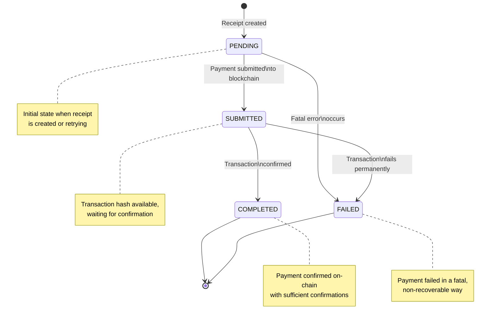

## Abstract

This RFC proposes migrating the dipper service from the current TAP (Timeline Aggregation Protocol) based payment mechanism to an On-Chain SAFE-based payment system. The new system will replace immediate TAP receipt responses with Receipt IDs, implement asynchronous on-chain payment processing through worker tasks, and provide indexers with a polling mechanism to track payment status. This change addresses the limitations of the current synchronous payment model and provides better reliability, transparency, and on-chain verifiability for payment processing.

## Background

The current dipper service uses TAP-based payments where indexers report work and immediately receive signed TAP receipts. This approach has several limitations:

1. **Synchronous Processing**: Payment creation is synchronous, causing potential delays in the work reporting workflow
2. **Limited Transparency**: TAP receipts provide limited visibility into actual payment execution 
3. **No On-Chain Verification**: The current system doesn't provide on-chain proof of payment
4. **Reliability Concerns**: Failed payments require manual intervention and retry mechanisms

The dipper service currently implements the following payment workflow:
- Indexer reports work via GRPC `collect_payment` endpoint
- Service validates the work and calculates fees
- TAP receipt is created and signed using `ReceiptSigner`
- Receipt is immediately returned to the indexer as serialized bytes

This RFC addresses the need for a more robust, transparent, and verifiable payment system that leverages on-chain SAFE transactions.

## Design

### Overview

Replace the TAP-based payment system with an on-chain SAFE-based approach that:

1. **Returns Receipt IDs** instead of TAP receipts for immediate response
2. **Implements asynchronous payment processing** using the existing worker system
3. **Provides status polling** for indexers to track payment progress
4. **Uses SAFE multisig contracts** for secure on-chain payment execution
5. **Maintains payment state** through a finite state machine

### Key Changes

#### 1. Workflow Modification
- **Current**: `report_work` → `validate` → `create_TAP_receipt` → `return_receipt_bytes`
- **Proposed**: `report_work` → `validate` → `create_receipt_record` → `queue_PAY_ON_CHAIN_job` → `return_receipt_ID`

#### 2. Payment Processing
- Move from synchronous TAP signing to asynchronous on-chain SAFE transactions
- Implement retry logic with exponential backoff for failed payments
- Atomic status updates for receipt state management

#### 3. Status Tracking
- Introduce Receipt State Machine: `PENDING` → `SUBMITTED` → `COMPLETED` / `FAILED`
- Provide GRPC polling endpoint for indexers to check payment status

### Finite State Machine (FSM)

The receipt payment status will follow a well-defined finite state machine:

- **PENDING**: Payment not yet attempted or currently retrying
- **SUBMITTED**: Payment submitted to blockchain, transaction hash available
- **COMPLETED**: Payment confirmed on-chain with sufficient confirmations
- **FAILED**: Payment failed in a fatal, non-recoverable way

State transitions:
- `PENDING` → `SUBMITTED` (when payment is submitted to blockchain)
- `SUBMITTED` → `COMPLETED` (when transaction is confirmed)
- `PENDING` → `FAILED` (when fatal error occurs)
- `SUBMITTED` → `FAILED` (when transaction fails permanently)

## Proposed Implementation

### Database Schema Changes

The existing indexing receipts table needs to be extended to support the new payment status tracking:

**Required new columns:**
- Payment status field: FSM state tracking (PENDING, SUBMITTED, COMPLETED, FAILED)
- Transaction hash field: On-chain transaction identifier when payment is submitted
- Payment submitted timestamp: When the payment was submitted to blockchain
- Payment completed timestamp: When the payment was confirmed on-chain
- Payment error field: Error message for failed payments
- Retry count field: Number of retry attempts for tracking

**Required indexes:**
- Index on payment status for efficient status-based queries
- Index on payment timestamps for time-based queries and cleanup

### Worker System Integration

#### New Message Type
Add a new payment message type to the existing worker message system alongside current indexing and agreement messages.

**Message structure requirements:**
- Include receipt identifier to identify which receipt to process
- Include payment amount for the payment value
- Include recipient address for the payment destination
- Follow existing worker message serialization patterns

#### Worker Handler Implementation
Create new payment handler following existing handler patterns:

**Handler functionality:**
- Update receipt status to SUBMITTED before attempting payment
- Execute SAFE transaction through SAFE client
- Handle successful payments by updating status to COMPLETED with transaction hash
- Implement retry logic for transient failures
- Mark permanently failed payments as FAILED status
- Ensure all status updates are atomic to prevent race conditions

### GRPC Interface Updates

#### Modified Payment Collection Response
Update the payment collection response structure:

**Changes required:**
- Replace TAP receipt bytes field with receipt identifier field
- Return the Receipt ID in the report work request response
- Maintain existing version and status fields for compatibility
- Ensure receipt identifiers are unique and suitable for polling

#### Update Existing Handlers
The payment collection handler needs major refactoring:
- Remove TAP receipt creation logic
- Change response from TAP receipt bytes to Receipt ID
- Add payment job queuing after receipt registration

#### New Polling Endpoint
Add new receipt status method to the existing GRPC service:

**Request structure:**
- Version field for API versioning
- Receipt identifier field to identify the receipt to query

**Response structure:**
- Version field for API versioning  
- Status enum field (PENDING, SUBMITTED, COMPLETED, FAILED)
- Optional transaction hash field populated when status is SUBMITTED/COMPLETED
- Optional payment submitted timestamp field
- Optional payment completed timestamp field  
- Optional error message field populated when status is FAILED

### SAFE Client Implementation

Create new SAFE client module with trait-based architecture:

**SAFE Client interface requirements:**
- Submit payment method accepting recipient address and amount
- Return transaction hash on successful submission
- Proper error handling distinguishing retryable vs fatal errors
- Async implementation compatible with existing worker system

**SAFE Client implementation needs:**
- SAFE contract address configuration
- RPC client for blockchain interaction
- Private key signer for transaction signing
- Gas estimation and management functionality
- Transaction confirmation tracking

### Configuration Changes

#### Remove TAP Configuration
**Components to remove:**
- TAP signer configuration structure
- TAP signer field from main configuration
- TAP signer initialization code
- TAP signer from indexer RPC server context

#### Add SAFE Configuration
**New SAFE client configuration requirements:**
- SAFE contract address for payment operations
- RPC endpoint URL for blockchain connectivity
- Private key configuration for transaction signing
- Gas limit and pricing parameters
- Chain ID for network identification
- Secure handling of sensitive configuration data

### Registry Interface Extensions

Extend the existing receipt registry interface with new methods:

**New method requirements:**
- Update receipt payment status: Atomic status updates with optional transaction hash
- Get receipt by identifier: Retrieve receipt with current payment status for polling
- Get pending receipts: Query for receipts in PENDING state (admin functionality)
- Get failed receipts: Query for receipts in FAILED state (admin functionality)

**New data structures:**
- Payment status enumeration with PENDING, SUBMITTED, COMPLETED, FAILED states
- Receipt with status structure combining receipt data with payment status
- Proper error handling for all registry operations

### Admin CLI Enhancements

The existing admin RPC server structure will be extended with new handlers for receipt management:

- List pending receipts: Query receipts in PENDING state
- List failed receipts: Query receipts in FAILED state  
- Retry failed receipt: Manually retry a failed receipt
- Get receipt details: Get detailed receipt information including payment history

## Migration Strategy

Since the service is under heavy development with no production deployment:

### 1. Direct Schema Updates
- Modify existing migration file directly
- Add payment status columns to receipts table
- No data preservation needed

### 2. Code Removal
Remove TAP-related components:
- TAP signing module
- TAP receipt creation in indexer RPC handlers
- Receipt signer initialization
- Receipt signer usage and initialization
- TAP configuration structures
- TAP-related imports and dependencies

### 3. Implementation Phases
1. Database schema changes and new registry methods
2. SAFE client implementation and worker handler
3. GRPC interface updates and polling endpoint
4. Remove TAP components
5. Integration and testing

## Monitoring and Observability

### 1. Metrics
- Track payment processing times
- Monitor success/failure rates
- Alert on stuck payments in PENDING state

### 2. Logging
- Log all state transitions
- Include transaction hashes in logs
- Add structured logging for payment events

## Testing Strategy

### 1. Unit Tests
- Test SAFE client functionality
- Test worker handler logic
- Test registry operations

### 2. Integration Tests
- Test end-to-end payment flow
- Test failure scenarios and retries
- Test GRPC endpoints

### 3. Load Testing
- Verify system performance under load
- Test worker queue capacity
- Validate database performance

## Alternatives Considered

### Synchronous SAFE Payments
**Rejected** due to potential delays in work reporting workflow and poor user experience during network congestion.

## Open Questions

1. **Gas Fee Management**: How should gas fees be handled? Fixed allocation or dynamic estimation?
2. **Transaction Batching**: Should multiple payments be batched into single SAFE transactions?
3. **Confirmation Requirements**: How many confirmations should be required before marking payments as completed?
4. **Error Recovery**: What should happen to receipts that fail repeatedly?

## Success Criteria

1. **Functional**: Indexers can successfully report work and receive payment confirmations
2. **Performance**: Payment processing doesn't significantly impact work reporting latency  
3. **Reliability**: 99.9% of payments are successfully processed within acceptable timeframes
4. **Transparency**: All payments are verifiable on-chain with transaction hashes

## Security/Privacy Considerations

### Private Key Management
- SAFE client private keys MUST be securely stored and managed
- Private keys MUST NOT be logged or exposed in configuration files

### Transaction Security
- All payment amounts and recipient addresses MUST be validated
- Proper gas estimation and limits MUST be implemented
- Transaction confirmation requirements MUST be enforced
- Payment data MUST be validated against expected ranges and formats

### State Consistency
- Receipt status updates MUST be atomic to prevent race conditions
- Error handling and rollback mechanisms MUST be implemented
- Monitoring for failed transactions MUST be added
- Database transactions MUST be used for all payment state changes

### Data Privacy
- Transaction hashes are public on-chain but don't expose sensitive user data
- Payment amounts and addresses follow existing privacy model
- No additional privacy implications beyond current system

## Copyright

Copyright and related rights waived [via CC0](https://creativecommons.org/publicdomain/zero/1.0/).

## References

### Normative References

- [RFC2119] Bradner, S., "Key words for use in RFCs to Indicate Requirement Levels", BCP 14, RFC 2119, DOI 10.17487/RFC2119, March 1997, <https://www.rfc-editor.org/rfc/rfc2119.html>.

### Informative References

- [SAFE Smart Account Documentation](https://docs.safe.global/)
- [Current TAP Implementation](bin/dipper-service/src/signing/tap.rs)
- [Worker System Architecture](bin/dipper-service/src/worker/)
- [GRPC Interface Definitions](dipper-rpc/src/indexer.rs)
